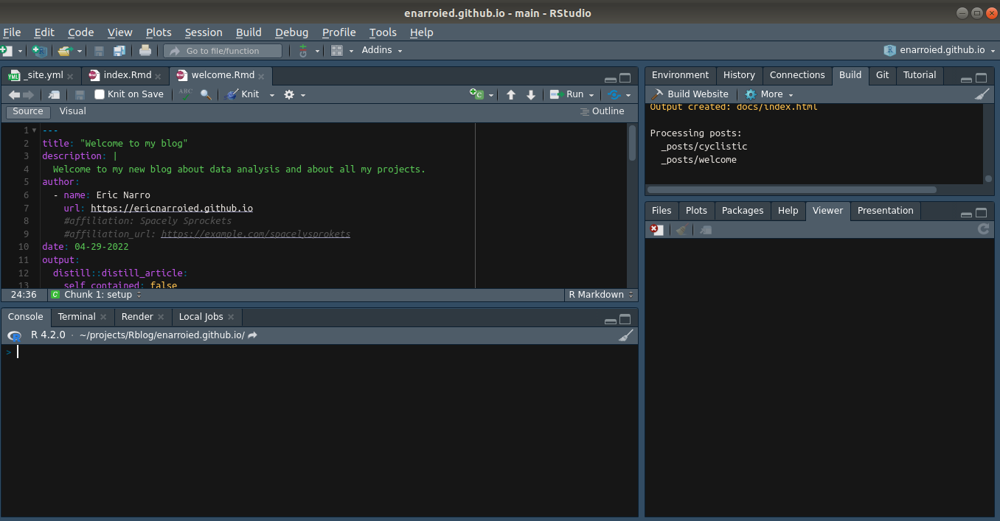

```{r setup, include=FALSE}
knitr::opts_chunk$set(echo = FALSE)

# Learn more about creating blogs with Distill at:
# https://rstudio.github.io/distill/blog.html

```


# Why did I make this blog?

I had been thinking about creating a blog to make a portfolio for quite some time. As you can find out [in my About page](../../about.html), I have been programming and doing projects since 2018, but the amount of time spent on projects increased over time as well as my will to become a developper and then a data analyst

When I started to create scripts that were really used for my work, and even a python plugin for QGis, I began publishing my work on github. 

I finally created my portfolio while completing the [Google Data Analytics'](https://coursera.org/share/451c19d4d66ef966778e8812398fd699) Professional Certificates on Coursera. 

Thinking further, I also think creating a blog can give me a space for expression, since I enjoy writing and it can also show my written communication skills. 

What I wanted was:

* A static portfolio site, where I could have :
    + A simple and clean landing page.
    + Easy to find contact information and connexion to my different social media profiles.
    + An about page, with more information about me, for those who want to know more about how I ended taking this path.
    + A resume section, in `HTML` (plus eventually a pdf version to download too).
    + A blog section to wrtite about my projects, data analysis, etc.
    + A project section with links to some of my projects posted on github or other platforms.
* To use Rstudio to have its own project folder, with git configured to make the workflow easier (I rather spend more time at first, take the risk of learning something, and then have a smooth process).
* To publish and host on Github pages, basically to not have it all spread across too many places.
* I use Ubuntu as desktop OS, so it has to be fine with that too.


# How did I create this blog?

This blog was created using the following stack:

* **Rmarkdown**: R markdown is very similar to markdown. Having previous experience with $\LaTeX{}$, this is an easy way to edit documents. Markdown is very used to document code so I thought it could be a good option.
* **R studio**: it is an IDE widely used to write R code. Since I created this blog to post my first project done with R, I thought it would be a good idea to access all the content from "the same window". It also helps me get more familiar with working with the tool and with git (with github).
* **distill and rmarkdown packages**: An R package to make simple blogs. I considered making it with the `blogdown` package using Hugo, but the documentation about it was not clear to me (and I wanted to host and publish my blog on Github and not on Netlify). 
* **R and other R libraries**: Since this is a blog about data analysis, I have used R and several libraries to clean, prepare, analyze and create visualizations. Since I am mostly familiar with python and jupyter notebooks, I wll probably integrate python projects too. And any other tool needed for the process.



Since all this environment is pretty new to me (I am again, more familiar with python and working with Visual Studio Code or Jupyter Notebooks) I had to learn it all from scratch. I looked for a lot of documentation on the internet, I tried blogdown but I did not feel confortable with it, I looked at distill and I found [this post from Danielle Brantley](https://datascidani.com/posts/2020-12-14-same-content-new-look/) that led me to choose the distill package.

So I built my blog adding the content and modifying the yaml file, usual stuff. The main modifications were the following:

* **Landing page / index.html**: I wanted a simple and intuitive landing page, a simple picture of me, some basic information and an easy way to find the content. The distill default page does not come with this. After a lot of research, I found the `postcards` package documented on the [distillery blog](https://distillery.rbind.io/posts/2021-03-16-postcards-distill/). It allows to make exactly what I wanted with just little modification of the `yml` file.
* **CSS**: I have some basic CSS knowledge, but to be honnest, styling is not my cup of tea, so I got 2 different files that I put together and modified a little. The code looks like a monster (with a few `!important` properties ), but the result is (I think) not so bad. 
    + So I first used the `postcards.css` from the postcard layout that I modified a little. I mostly changed the color scheme and added background color to code chunks and to tables, to make them stand out and adding some `overflow: auto` so tables and code blocks do not take too much space on the page. You can find the original file in [Alisson Premanes Hill's github](https://github.com/apreshill/mfeo/blob/master/postcards.css)
    + I then saw [Michael Clark's blog](https://m-clark.github.io/), and I copy-pasted some of [his CSS file](https://github.com/m-clark/m-clark.github.io/blob/master/styles.css) modifying the color scheme to match mine.
    

* **Other "stuff"**: Surfing the web in the quest for various distill-related informations, I found [this article by Zoe Turner](Navigatihttps://lextuga007.github.io/PhilosopherAnalyst/posts/2021-01-31-adding-disqus-to-distill-blogs/), that references this other [blog post by Shamindra Shrotiya](https://www.shamindras.com/posts/2019-07-31-shrotriya2019distillpt2/). I was not specifically looking for all this at first, but adding functionality to the blog is always nice (and fun), plus it was probably the easiest and painless part to all the process. All the steps are documented in Shamindra's blog post, so check it out. This is what I added do my blog following his steps:
  + I created a Disqus account, and now you can leave comments on my blog posts, so feel free to comment!
  + I added the repository url to my `_site.yaml` file, so now people can suggest changes to my files directly on github. I also added the RSS feed link because: Why not?
  + I added a Google Analytics tracking option. I did not think about it at first but I feels so obvious now that I should be able to know how many views my blog has... Plus it is data I may one day analyze!
  + The options to share blog posts on social media were already added for twitter and linkedIn, but adding all this new options made me want to add more sharing options, like linkedIn or Pinterest (feel free to pin any awesome chart!).

Then I created a CV tab were you can find my resume, in pdf format.


# Other learning ressources

The resources mentioned above have been major inspirations, often with copy-paste to build my website. I also used the following resources:

* [Rstudio documentation about distill package](https://rstudio.github.io/distill/)

* [An intro to distill by rstudio4edu](https://rstudio4edu.github.io/rstudio4edu-book/intro-distill.html)

* And really, many others, so thank you again Google.
