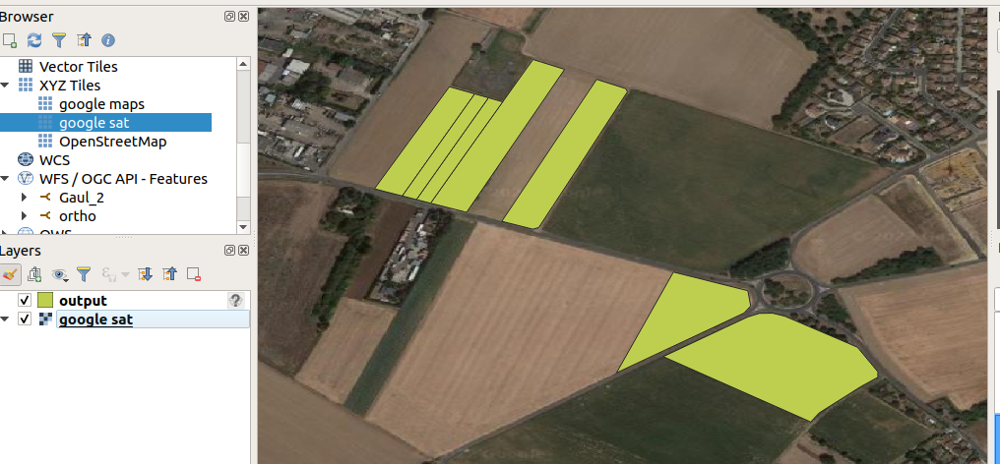

```{r setup, include=FALSE}
knitr::opts_chunk$set(echo = FALSE)

# Learn more about creating blogs with Distill at:
# https://rstudio.github.io/distill/blog.html

```

# Project context

This script was created in 2021 (I created it prior to uploading it to github) when I was working as a vineyard technician for an organic association and had to monitor several vineyards to look for the Flavescence Dorée leafhoper (*Scaphoideus titanus*), an insect that vectors a deadly disease for vines.

In France, all winegrowers need to declare their vines to the "viticulture Customs service". As a result, their vines are listed in their CVI (*Casier Vivitole Informatisé*) and they can edit a pdf document listing all their parcels.

This document has a very precise format that allows the creation of a script to parse it. The document has land registry information, so I used it to link it to files containing land registry geographic information. The link with all the data for France can be found here : https://cadastre.data.gouv.fr/datasets/cadastre-etalab.

Prior to using this script, information was collected from pdf files or paper documents by hand, copied to an excel sheet to have the attributes of the vine parcels. Then, using the land registry information, parcels were drawn by hang using an online web service : https://www.geoportail.gouv.fr/.

In 2021, I had close to 1000 vines to monitor (we grouped them, so it was way less in the field, but it was about 1000 records to introduce manually in an excel sheet.. yupi!).

Thanks to the script, the pdf files and the land registry information files allowed me to create CSV files with all the attributes and also associate geographic information for further processing with QGIS. In about 1 minute.

# How it works

To work, CVI files need to be placed in the cvi file. Land registry json files need to be placed in the CADASTRE file.

Land registry json files are downloaded from the public service page listed above. They should match the town or the department where vines are located. We can assume that anyone using this script knows that information.

The script reads the pdf file and generates a csv file using the [tabula-py python library](https://pypi.org/project/tabula-py/).

Then it parses all the lines and stores all the required information in lists or as string (depending on the information type).

It then parses the geojson files. If land registry information matches one from the list, a record is written in the `output.csv` file, with geographic information and the needed records from the pdf file.

At the end of the iteration, all remaining entries still stored in the list (if any) are written in the `output_fail.csv` file.

# Get the script

The script can be found on my github repository : https://github.com/enarroied/cvi_geometry.

The test CVI file is a mock-up since real files contain sensitive information.


